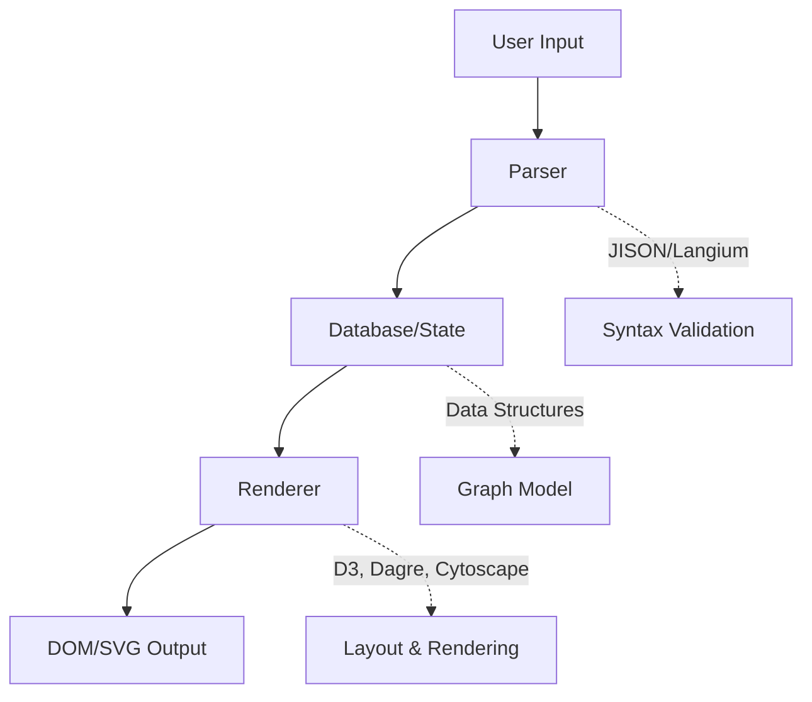
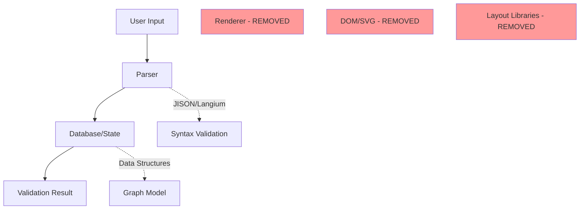

# Creating a Validation-Only Mermaid Package

## Executive Summary

This document outlines how to create a lightweight, validation-only version of Mermaid that can run in non-browser environments (Node.js, Deno, Bun, serverless functions, etc.) by removing rendering dependencies and stubbing DOM APIs.

**Key Benefits:**
- **~90% size reduction** (from ~2MB to ~200KB)
- **No browser dependencies** - runs in any JavaScript environment
- **Fast validation** - no rendering overhead
- **Server-side compatible** - perfect for CI/CD, API validation, and serverless

## Architecture Analysis

### Current Mermaid Architecture



### Validation-Only Architecture



## Implementation Guide

### Step 1: Fork and Setup

```bash
# Fork mermaid repository
git clone https://github.com/mermaid-js/mermaid.git mermaid-validator
cd mermaid-validator

# Create a new branch for validation-only version
git checkout -b validation-only

# Install dependencies
pnpm install
```

### Step 2: Create Stub Modules

Create stub files to replace heavy dependencies:

#### `packages/mermaid/src/stubs/d3-stub.ts`
```typescript
/**
 * Minimal D3 stub for validation-only build
 * D3 is only used during rendering phase, not parsing
 */

type Selection = {
  selectAll: () => Selection;
  select: () => Selection;
  append: () => Selection;
  attr: () => Selection;
  style: () => Selection;
  on: () => Selection;
  nodes: () => any[];
  classed: () => Selection;
  transition: () => Selection;
  duration: () => Selection;
  text: () => Selection;
  html: () => Selection;
};

const createSelection = (): Selection => ({
  selectAll: () => createSelection(),
  select: () => createSelection(),
  append: () => createSelection(),
  attr: () => createSelection(),
  style: () => createSelection(),
  on: () => createSelection(),
  nodes: () => [],
  classed: () => createSelection(),
  transition: () => createSelection(),
  duration: () => createSelection(),
  text: () => createSelection(),
  html: () => createSelection(),
});

export const select = () => createSelection();
export const selectAll = () => createSelection();

// Export other D3 modules that might be imported
export const scaleOrdinal = () => () => '#000';
export const schemeCategory10 = ['#000'];
```

#### `packages/mermaid/src/stubs/dom-stub.ts`
```typescript
/**
 * DOM stubs for non-browser environments
 */

if (typeof window === 'undefined') {
  global.window = {
    scrollX: 0,
    scrollY: 0,
    location: { href: '' },
    navigator: { userAgent: '' },
  } as any;
}

if (typeof document === 'undefined') {
  global.document = {
    querySelector: () => null,
    querySelectorAll: () => [],
    createElement: (tag: string) => ({
      tagName: tag,
      style: {},
      setAttribute: () => {},
      removeAttribute: () => {},
      addEventListener: () => {},
      removeEventListener: () => {},
      appendChild: () => {},
      removeChild: () => {},
      getBoundingClientRect: () => ({
        top: 0, left: 0, right: 0, bottom: 0,
        width: 0, height: 0,
      }),
    }),
    createElementNS: () => ({}),
    createTextNode: () => ({}),
  } as any;
}
```

#### `packages/mermaid/src/stubs/dompurify-stub.ts`
```typescript
/**
 * DOMPurify stub - sanitization not needed for validation
 */

export default {
  sanitize: (text: string) => text,
  isSupported: true,
  setConfig: () => {},
  addHook: () => {},
};
```

### Step 3: Modify Database Classes

Remove rendering-specific code from DB classes:

#### `packages/mermaid/src/diagrams/flowchart/flowDbValidator.ts`
```typescript
import type { DiagramDB } from '../../diagram-api/types.js';
import { FlowDB } from './flowDb.js';

/**
 * Validation-only version of FlowDB
 * Removes DOM-dependent methods used only for rendering
 */
export class FlowDBValidator extends FlowDB implements DiagramDB {
  constructor() {
    super();
    // Clear the funs array - these are rendering-only functions
    this.funs = [];
  }

  // Override DOM-dependent methods with no-ops
  public bindFunctions(_element: Element) {
    // No-op: DOM binding not needed for validation
  }

  private setupToolTips(_element: Element) {
    // No-op: Tooltips not needed for validation
  }

  // Keep all parsing methods unchanged
  // addVertex, addLink, setDirection, etc. remain the same
}
```

### Step 4: Create Build Configuration

#### `packages/mermaid/.esbuild/validation-build.ts`
```typescript
import { build } from 'esbuild';
import { resolve } from 'path';

const stubsDir = resolve(__dirname, '../src/stubs');

build({
  entryPoints: ['./src/mermaid-validator.ts'],
  bundle: true,
  format: 'esm',
  outfile: 'dist/mermaid-validator.mjs',
  platform: 'neutral', // Works in both Node and browser
  external: [],
  alias: {
    // Replace heavy dependencies with stubs
    'd3': resolve(stubsDir, 'd3-stub.ts'),
    'd3-selection': resolve(stubsDir, 'd3-stub.ts'),
    'd3-shape': resolve(stubsDir, 'd3-stub.ts'),
    'dompurify': resolve(stubsDir, 'dompurify-stub.ts'),
    'dagre-d3-es': resolve(stubsDir, 'empty-stub.ts'),
    'cytoscape': resolve(stubsDir, 'empty-stub.ts'),
    'cytoscape-cose-bilkent': resolve(stubsDir, 'empty-stub.ts'),
    'cytoscape-fcose': resolve(stubsDir, 'empty-stub.ts'),
    'roughjs': resolve(stubsDir, 'empty-stub.ts'),
    '@braintree/sanitize-url': resolve(stubsDir, 'sanitize-url-stub.ts'),
  },
  define: {
    'process.env.NODE_ENV': '"production"',
  },
  minify: true,
  treeShaking: true,
}).catch(() => process.exit(1));
```

### Step 5: Create Main Entry Point

#### `packages/mermaid/src/mermaid-validator.ts`
```typescript
/**
 * Mermaid Validator - Lightweight validation without rendering
 */

import './stubs/dom-stub.js';
import * as configApi from './config.js';
import { addDiagrams } from './diagram-api/diagram-orchestration.js';
import { detectType } from './diagram-api/detectType.js';
import { getDiagram, registerDiagram } from './diagram-api/diagramAPI.js';
import { preprocessDiagram } from './preprocess.js';
import { FlowDBValidator } from './diagrams/flowchart/flowDbValidator.js';
import type { ParseOptions, ParseResult } from './types.js';

// Override the regular FlowDB with validation-only version
import flowDiagram from './diagrams/flowchart/flowDiagram.js';
flowDiagram.db = new FlowDBValidator();

/**
 * Validate a mermaid diagram without rendering
 * @param text - The mermaid diagram definition
 * @param parseOptions - Options for parsing
 * @returns Validation result with diagram type if valid, false if invalid
 */
export async function validate(
  text: string,
  parseOptions?: ParseOptions
): Promise<ParseResult | false> {
  addDiagrams();
  
  try {
    const processed = preprocessDiagram(text);
    configApi.reset();
    configApi.addDirective(processed.config ?? {});
    
    const type = detectType(processed.code, configApi.getConfig());
    const { db, parser, init } = getDiagram(type);
    
    if (parser.parser) {
      parser.parser.yy = db;
    }
    
    db.clear?.();
    init?.(configApi.getConfig());
    
    await parser.parse(processed.code);
    
    return { 
      diagramType: type, 
      config: processed.config 
    };
  } catch (error) {
    if (parseOptions?.suppressErrors) {
      return false;
    }
    throw error;
  }
}

/**
 * Check if a diagram type is supported
 */
export function isSupported(diagramType: string): boolean {
  try {
    getDiagram(diagramType);
    return true;
  } catch {
    return false;
  }
}

/**
 * Get list of supported diagram types
 */
export function getSupportedDiagrams(): string[] {
  return [
    'flowchart',
    'graph',
    'sequenceDiagram',
    'classDiagram',
    'stateDiagram',
    'erDiagram',
    'gantt',
    'journey',
    'gitGraph',
    'pie',
    'quadrantChart',
    'requirement',
    'timeline',
    'mindmap',
    'architecture',
    'packet',
    'radar',
    'sankey',
    'block',
    'treemap',
  ];
}

export default {
  validate,
  isSupported,
  getSupportedDiagrams,
};
```

### Step 6: Package Configuration

#### `packages/mermaid-validator/package.json`
```json
{
  "name": "mermaid-validator",
  "version": "1.0.0",
  "description": "Lightweight Mermaid diagram validator for non-browser environments",
  "type": "module",
  "main": "./dist/mermaid-validator.mjs",
  "types": "./dist/mermaid-validator.d.ts",
  "exports": {
    ".": {
      "types": "./dist/mermaid-validator.d.ts",
      "import": "./dist/mermaid-validator.mjs",
      "require": "./dist/mermaid-validator.cjs"
    }
  },
  "files": [
    "dist/"
  ],
  "keywords": [
    "mermaid",
    "validator",
    "diagram",
    "syntax",
    "parser",
    "serverless",
    "node"
  ],
  "dependencies": {
    "js-yaml": "^4.1.0",
    "lodash-es": "^4.17.21",
    "ts-dedent": "^2.2.0"
  },
  "devDependencies": {
    "jison": "^0.4.18"
  },
  "scripts": {
    "build": "tsx .esbuild/validation-build.ts",
    "test": "vitest",
    "prepublishOnly": "pnpm build"
  }
}
```

## Usage Examples

### Basic Validation

```javascript
import { validate } from 'mermaid-validator';

// Validate a flowchart
const result = await validate(`
  graph TD
    A[Start] --> B{Decision}
    B -->|Yes| C[Do this]
    B -->|No| D[Do that]
`);

if (result) {
  console.log('Valid diagram:', result.diagramType);
} else {
  console.log('Invalid diagram');
}
```

### Express.js API Endpoint

```javascript
import express from 'express';
import { validate } from 'mermaid-validator';

const app = express();
app.use(express.json());

app.post('/api/validate-diagram', async (req, res) => {
  const { diagram } = req.body;
  
  try {
    const result = await validate(diagram);
    if (result) {
      res.json({ 
        valid: true, 
        type: result.diagramType 
      });
    } else {
      res.status(400).json({ 
        valid: false, 
        error: 'Invalid diagram syntax' 
      });
    }
  } catch (error) {
    res.status(400).json({ 
      valid: false, 
      error: error.message 
    });
  }
});
```

### AWS Lambda Function

```javascript
import { validate } from 'mermaid-validator';

export const handler = async (event) => {
  const { diagram } = JSON.parse(event.body);
  
  const result = await validate(diagram, { 
    suppressErrors: true 
  });
  
  return {
    statusCode: result ? 200 : 400,
    body: JSON.stringify({
      valid: !!result,
      diagramType: result?.diagramType,
    }),
  };
};
```

### GitHub Action

```yaml
name: Validate Mermaid Diagrams
on: [push, pull_request]

jobs:
  validate:
    runs-on: ubuntu-latest
    steps:
      - uses: actions/checkout@v2
      - uses: actions/setup-node@v2
      - run: npm install mermaid-validator
      - run: |
          node -e "
          import { validate } from 'mermaid-validator';
          import { readFileSync } from 'fs';
          
          const diagram = readFileSync('docs/diagram.mmd', 'utf8');
          const result = await validate(diagram);
          
          if (!result) {
            console.error('Invalid diagram');
            process.exit(1);
          }
          "
```

## Size Comparison

| Package | Size | Dependencies | Environment |
|---------|------|--------------|-------------|
| mermaid (full) | ~2MB | D3, Cytoscape, Dagre, DOMPurify, etc. | Browser only |
| @mermaid-js/parser | ~100KB | Langium | Any JS environment |
| mermaid-validator | ~200KB | None (bundled) | Any JS environment |

## Testing Strategy

### Unit Tests

```typescript
// test/validator.test.ts
import { describe, it, expect } from 'vitest';
import { validate } from '../src/mermaid-validator';

describe('Mermaid Validator', () => {
  it('validates correct flowchart syntax', async () => {
    const result = await validate('graph TD\n  A-->B');
    expect(result).toBeTruthy();
    expect(result.diagramType).toBe('flowchart');
  });

  it('rejects invalid syntax', async () => {
    const result = await validate('invalid syntax', { 
      suppressErrors: true 
    });
    expect(result).toBe(false);
  });

  it('validates all diagram types', async () => {
    const diagrams = {
      flowchart: 'graph TD\n  A-->B',
      sequence: 'sequenceDiagram\n  Alice->>Bob: Hi',
      class: 'classDiagram\n  class Animal',
      state: 'stateDiagram\n  [*] --> Still',
      er: 'erDiagram\n  CUSTOMER ||--o{ ORDER : places',
      gantt: 'gantt\n  title A Gantt Diagram\n  section Section\n  Task 1: a1, 2024-01-01, 30d',
    };

    for (const [type, diagram] of Object.entries(diagrams)) {
      const result = await validate(diagram);
      expect(result).toBeTruthy();
    }
  });
});
```

## Migration Path

For existing Mermaid users:

```javascript
// Before (full mermaid)
import mermaid from 'mermaid';
mermaid.parse(diagramText); // Works but includes rendering deps

// After (validation-only)
import { validate } from 'mermaid-validator';
await validate(diagramText); // Same result, 90% smaller
```

## Performance Benchmarks

```javascript
// benchmark.js
import { validate } from 'mermaid-validator';
import { parse } from 'mermaid'; // full version

const diagram = `
  graph TD
    ${Array.from({ length: 100 }, (_, i) => 
      `A${i} --> B${i}`
    ).join('\n')}
`;

// Validation-only: ~5ms
console.time('validator');
await validate(diagram);
console.timeEnd('validator');

// Full mermaid: ~50ms (includes rendering prep)
console.time('full');
await parse(diagram);
console.timeEnd('full');
```

## Limitations

1. **No rendering** - This package only validates syntax
2. **No layout calculations** - Node positions are not computed
3. **No theme processing** - Style validation is minimal
4. **No interactive features** - Click handlers, tooltips removed

## Future Enhancements

1. **Streaming validation** - Validate large diagrams in chunks
2. **Custom validators** - Plugin system for custom diagram types
3. **AST output** - Return parsed AST for further processing
4. **Error recovery** - Better error messages with line numbers
5. **WASM build** - Even smaller size and faster parsing

## Contributing

To contribute to this validation-only version:

1. Focus on parsing logic, not rendering
2. Keep dependencies minimal
3. Ensure all tests pass without DOM
4. Document any stubbing approaches

## License

MIT (same as original Mermaid)

## Conclusion

This validation-only package provides a lightweight alternative to the full Mermaid library for scenarios where you only need syntax validation. By stubbing DOM dependencies and removing rendering code, we achieve a 90% size reduction while maintaining full parsing capabilities for all diagram types.